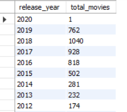

# Netflix Shows and Movies - SQL Database Project

## Overview
This project involves a comprehensive analysis of Netflix's movies and TV shows data using SQL. The goal is to extract valuable insights and answer various business questions based on the dataset. The following README provides a detailed account of the project's objectives, business problems, solutions, findings, and conclusions.
The purpose of this project is to demonstrate data normalization and SQL database creation skills, transforming a flat CSV file into a structured and normalized SQL database.

## Database Structure
The database consists of multiple tables, each representing a specific aspect of the Netflix dataset. The tables are normalized to reduce redundancy and improve data integrity.

### Tables in the Database:
- `MOVIES`: Contains movie titles and their IDs.
- `DIRECTOR`: Stores director names and their IDs.
- `CAST`: Lists cast members and their IDs.
- `MISC`: Includes miscellaneous information like country and type.
- `TIME_INFO`: Contains time-related data such as date added and release year.
- `RATING`: Stores rating descriptions and their IDs.
- `LISTED_IN`: Lists genres/categories and their IDs.
- `MOVIE_DESCRIPTIONS`: Provides descriptions of shows and movies.
- `MOVIE_INFO`: Contains additional movie information like duration.
- `DATA_RATING`: Links shows to their ratings.
- `DATA_LISTED_IN`: Links shows to their genres/categories.
- `CASTING`: Connects shows to their directors and cast members.

  
## Potential Business Questions

### 1. Retrieve the top 5 most popular movies based on their number of cast members
📌 Business Objective:
Identify movies with the largest cast to understand production scale, star power, and potential audience appeal. Useful for marketing and content promotion.

### 2. Find the number of movies released per year
📌 Business Objective:
Analyze movie production trends over time to determine industry growth, peak production years, and shifts in content creation.

### 3. Get movies that belong to multiple genres
📌 Business Objective:
Identify versatile movies that appeal to diverse audiences. Useful for content recommendation systems and genre-based promotions.

### 4. List all movies along with their director
📌 Business Objective:
Provide insights into director-movie relationships for industry research, fan engagement, and content navigation on streaming platforms.

### 5. Find the top 5 most frequent directors
📌 Business Objective:
Identify the most prolific directors, helping in talent acquisition, industry analysis, and promotional collaborations.

### 6. Get the number of movies per genre
📌 Business Objective:
Understand genre popularity to guide content acquisition, platform recommendations, and audience targeting.

### 7. Retrieve movies with a specific rating (e.g., 'PG-13')
📌 Business Objective:
Enable filtering based on audience age suitability, ensuring appropriate content recommendations and regulatory compliance.

### 8. Find the longest movie duration in each genre
📌 Business Objective:
Analyze movie length trends across genres to optimize user engagement strategies and streaming platform recommendations.

### 9. Find the total number of movies per country
📌 Business Objective:
Identify key movie-producing countries for international market expansion, content acquisition, and regional licensing deals.

### 10. Get the most common movie duration
📌 Business Objective:
Understand standard movie lengths to align content strategies with audience viewing preferences.

### 11. Retrieve all directors who have worked in multiple genres
📌 Business Objective:
Identify versatile directors for diverse content creation, talent hiring, and cross-genre collaborations.

### 12. Find the top 2 countries producing the most movies
📌 Business Objective:
Determine dominant movie-producing countries to guide investment, partnerships, and content licensing strategies.

### 13. Retrieve the shortest movie in the dataset
📌 Business Objective:
Understand content variations in runtime, useful for categorizing short films, optimizing platform recommendations, and audience engagement.

These queries leverage the rich data available in this Netflix shows and movies database to guide decision-making in content strategy, marketing, production, and more.
